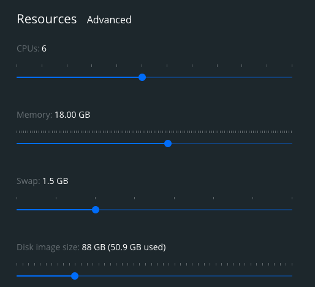

# Open Management Demo
_This demo intends to demonstrate how to orchestrate multi-cluster kubernetes using `Open Cluster Management`. We will create two KinD clusters: a hub cluster, and a management cluster. We will deploy a cluster manager on the hub cluster, and a `klusterlet agent` on the managed cluster. After that we will establish trust, by way of a Certificate Signing Request on the Hub Cluster. Once the CSR is created, we will join the managed cluster to the hub cluster. Then we will use the Hub Cluster to deploy a workload into the managed Cluster._

- [Prerequisites](#prerequisites)
- [Setup Clusters](#setup-clusters)
- [Install ACM Control Plane on Hub](#install-acm-control-plane-on-hub)
- [Deploy Klusterlet Agent to Managed Cluster](#deploy-klusterlet-agent-to-managed-cluster)
- [Use CSR from Hub and import Managed Cluster](#use-csr-from-hub-and-import-managed-cluster)
- [Setup `ManagedClusterSet` and `ManagedClusterSetBinding` and add our `Managed` Cluster](#setup-managedclusterset-and-managedclustersetbinding-and-add-our-managed-cluster)
- [Deploy an app on the managed cluster](#deploy-an-app-on-the-managed-cluster)
- [Cleanup](#cleanup)

## Prerequisites

Make life easier:
```
alias k=kubectl
```
_Before starting this demo, you will need the following tools._
- [Docker](https://docs.docker.com/get-docker/)
- [Kind](https://kind.sigs.k8s.io/docs/user/quick-start/) 
- [Clusteradm CLI tool](https://github.com/open-cluster-management-io/clusteradm/releases/latest)
- [kubectl](https://kubernetes.io/docs/tasks/tools/)

Make sure docker have sufficient resources. The first time I tried this demo I had pods failing because there was insufficient space. These resource settings worked for me.

   

## Setup Clusters
Create environmental variables for your cluster's contexts and names.
```
export HUB_CLUSTER_NAME=hub
export MANAGED_CLUSTER_NAME=cluster1
export CTX_HUB_CLUSTER=kind-hub
export CTX_MANAGED_CLUSTER=kind-cluster1
```
   
Spin up a Hub and a Managed cluster in KinD.
```
kind create cluster --name ${HUB_CLUSTER_NAME}
kind create cluster --name ${MANAGED_CLUSTER_NAME}
```

## Install ACM Control Plane on Hub
Bootstrap the Open Cluster Management control plane on the `Hub`.
```
clusteradm init --context $CTX_HUB_CLUSTER
```

output
```
The multicluster hub control plane has been initialized successfully!

You can now register cluster(s) to the hub control plane. Log onto those cluster(s) and run the following command:

    clusteradm join --hub-token eyJhbGciOiJSUzI1NiIsImtpZCI6Im80QUZ5YmFOelh3cXhhaUZTejFYd2d4UWR3aVBVdlJEV1dOVTgxejB2TGsifQ.eyJpc3MiOiJrdWJlcm5ldGVzL3NlcnZpY2VhY2NvdW50Iiwia3ViZXJuZXRlcy5pby9zZXJ2aWNlYWNjb3VudC9uYW1lc3BhY2UiOiJvcGVuLWNsdXN0ZXItbWFuYWdlbWVudCIsImt1YmVybmV0ZXMuaW8vc2VydmljZWFjY291bnQvc2VjcmV0Lm5hbWUiOiJjbHVzdGVyLWJvb3RzdHJhcC10b2tlbi12cnNiciIsImt1YmVybmV0ZXMuaW8vc2VydmljZWFjY291bnQvc2VydmljZS1hY2NvdW50Lm5hbWUiOiJjbHVzdGVyLWJvb3RzdHJhcCIsImt1YmVybmV0ZXMuaW8vc2VydmljZWFjY291bnQvc2VydmljZS1hY2NvdW50LnVpZCI6IjZhNjhmMGMxLWMyZDYtNGE4My1hZjYwLTdiMDNiNzczMDhmNyIsInN1YiI6InN5c3RlbTpzZXJ2aWNlYWNjb3VudDpvcGVuLWNsdXN0ZXItbWFuYWdlbWVudDpjbHVzdGVyLWJvb3RzdHJhcCJ9.HeoIf4nvSAH_gSyQ5-7ERx-JSLZY_-9aZENwaMx4ybmB9b4A4f9eHjmfX8q2I99m-2Wnq-YCwJPC8My2jinqHfLHP0matdGyIoKecOjwOexYmxU7AyEEsuWkt8es0FSQxFV5lcL3zeYiPNb1PtAivWPnNeRLrijbpMtg6ft3reZs1BPiwS5htCsBmlT4Qjhinn7eAtD7dukt_pBXkENSktl32RsBIsmZjx9gSOveH_Skf-bG31Hkj2ONpn8YFMzxbzLHx3Y4RYSQvzVKYjtlz-qA0SL8NZaDyx6a1N3oDVuhSdLTgrEFTTdRzPBkhVXDiNLiqj6RFowjTSBR4jVSsw --hub-apiserver https://127.0.0.1:52968 --cluster-name <cluster_name>

Replace <cluster_name> with a cluster name of your choice. For example, cluster1.
```

Set More environmental variables for `HUB_TOKEN` and `HUB_APISERVER` based on output from last command
```
HUB_TOKEN=eyJhbGciOiJSUzI1NiIsImtpZCI6InB0YlYzaWw2R3A4blRXVzNfemhZcHN6VmVmNnJic2VvMEM5NlFIcUVTeHcifQ.eyJpc3MiOiJrdWJlcm5ldGVzL3NlcnZpY2VhY2NvdW50Iiwia3ViZXJuZXRlcy5pby9zZXJ2aWNlYWNjb3VudC9uYW1lc3BhY2UiOiJvcGVuLWNsdXN0ZXItbWFuYWdlbWVudCIsImt1YmVybmV0ZXMuaW8vc2VydmljZWFjY291bnQvc2VjcmV0Lm5hbWUiOiJjbHVzdGVyLWJvb3RzdHJhcC10b2tlbi03Zm05YyIsImt1YmVybmV0ZXMuaW8vc2VydmljZWFjY291bnQvc2VydmljZS1hY2NvdW50Lm5hbWUiOiJjbHVzdGVyLWJvb3RzdHJhcCIsImt1YmVybmV0ZXMuaW8vc2VydmljZWFjY291bnQvc2VydmljZS1hY2NvdW50LnVpZCI6IjdlNmIzNGZhLTQxZWUtNDA1OS1iZGMzLTQ1OTViNDM0NTRlMyIsInN1YiI6InN5c3RlbTpzZXJ2aWNlYWNjb3VudDpvcGVuLWNsdXN0ZXItbWFuYWdlbWVudDpjbHVzdGVyLWJvb3RzdHJhcCJ9.qqF268cYnf63Cn0zprRYcsnx5JmpMqj9ReVqApLj_Ua8IK5XyCZbgTQuLe7c8oA1OgrxmFPp8jUIbvApf5hQPFjwOMDjkEl21J4aytNRgWuEdkiJo7hcrU8eywYco0zjQJ8S6ML7wsbtweJHsCpQ8T5nwMWMb1uXEAqgZh5dPvHuEKVAbbUeSQp74fDaunJvodTzH2mkq_OmoxE-188QDHLUc7SlIjbziBNcxS75rwm0Q1T1Hxk8e4jTgcgQfX0GeDZ8enk3KtAC0SnRi9m052abwusZmhxrsYI8Uj8RTWzv9IZGHtquqmZbo-8KkQ7lwT3J28qi_KPZvVh7J8ZwCQ

HUB_APISERVER=https://127.0.0.1:59812
```
## Deploy Klusterlet Agent to Managed Cluster
```
clusteradm join --hub-token $HUB_TOKEN --hub-apiserver $HUB_APISERVER --cluster-name $MANAGED_CLUSTER_NAME
```

output
```
Deploying klusterlet agent. Please wait a few minutes then log onto the hub cluster and run the following command:

    clusteradm accept --clusters cluster1

```

## Use CSR from Hub and import Managed Cluster
Wait for CSR to be created on your Hub cluster. 

```
kubectl get csr -w --context ${CTX_HUB_CLUSTER} | grep ${MANAGED_CLUSTER_NAME}
```

output
```
cluster1-pvlkr   11m   kubernetes.io/kube-apiserver-client   system:serviceaccount:open-cluster-management:cluster-bootstrap   Pending
```

> Based on my findings, the output of this command this will stay in a `Pending` state forever. After about 3 - 5 mins run `clusteradm accept` from the Hub to accept the Managed cluster.

Import the managed cluster to the Hub cluster
```
clusteradm accept --clusters ${MANAGED_CLUSTER_NAME} --context ${CTX_HUB_CLUSTER}
```

output
```
CSR cluster1-pvlkr approved
set hubAcceptsClient to true for managed cluster cluster1
```

Verify that the managed cluster has been imported from the Hub Cluster
```
kubectl get managedcluster --context ${CTX_HUB_CLUSTER}
```

output
```
NAME       HUB ACCEPTED   MANAGED CLUSTER URLS      JOINED   AVAILABLE   AGE
cluster1   true           https://127.0.0.1:59812   True     True        12m
```


## Setup `ManagedClusterSet` and `ManagedClusterSetBinding` and add our `Managed` Cluster
Label the managed cluster `environment=dev`
```
kubectl --context ${CTX_HUB_CLUSTER} label managedcluster cluster1 environment=dev
```
**output**
```
managedcluster.cluster.open-cluster-management.io/cluster1 labeled
```

Create a `ManagedClusterSet`
```
k apply -f - --context $CTX_HUB_CLUSTER <<EOF
apiVersion: cluster.open-cluster-management.io/v1alpha1
kind: ManagedClusterSet
metadata:
  name: clusterset1
EOF
```

**output**
```
managedclusterset.cluster.open-cluster-management.io/clusterset1 created
```

Add our `Managed` Cluster to the `ManagedClusterSet` by labeling it
```
kubectl --context ${CTX_HUB_CLUSTER} label managedcluster cluster1 cluster.open-cluster-management.io/clusterset=clusterset1
```
output
```
managedcluster.cluster.open-cluster-management.io/cluster1 labeled
```

Create `ManagedClusterSetBinding` to bind the `ManagedClusterSet` to the default namespace on the `Managed` Cluster
```
k apply -f - --context $CTX_HUB_CLUSTER <<EOF
apiVersion: cluster.open-cluster-management.io/v1alpha1
kind: ManagedClusterSetBinding
metadata:
  name: clusterset1
  namespace: default
spec:
  clusterSet: clusterset1
EOF
```

output
```
managedclustersetbinding.cluster.open-cluster-management.io/clusterset1 created
```


Create a `Placement` to choose the `dev` environment cluster in the `default` Namespace
```
k apply -f - --context $CTX_HUB_CLUSTER <<EOF
apiVersion: cluster.open-cluster-management.io/v1alpha1
kind: Placement
metadata:
  name: placement1
  namespace: default
spec:
  predicates:
    - requiredClusterSelector:
        labelSelector:
          matchLabels:
            environment: dev
EOF
```

**output**
```
placement.cluster.open-cluster-management.io/placement1 created
```

Validate that this displays our `managed` cluster.
```
kubectl --context ${CTX_HUB_CLUSTER} get placementdecisions placement1-decision-1 -o jsonpath='{.status.decisions}'
```

output
```
[{"clusterName":"cluster1","reason":""}]%

```
https://open-cluster-management.io/getting-started/quick-start/


## Deploy an app on the managed cluster
Apply this work manifest, representing a `Hello World` application deployment into the `Hub` Cluster in the `cluster1` namespace.
```
cat <<EOF | kubectl --context ${CTX_HUB_CLUSTER} apply -f -
apiVersion: work.open-cluster-management.io/v1
kind: ManifestWork
metadata:
  name: hello-world
  namespace: cluster1
  labels:
    app: hello
spec:
  workload:
    manifests:
      - apiVersion: apps/v1
        kind: Deployment
        metadata:
          name: hello
          namespace: default

        spec:
          selector:
            matchLabels:
              app: hello
          template:
            metadata:
              labels:
                app: hello
            spec:
              containers:
                - name: hello
                  image: quay.io/asmacdo/busybox
                  command: ['sh', '-c', 'echo "Hello, World!" && sleep 3600']
EOF
```

**output**
```
manifestwork.work.open-cluster-management.io/hello-world created
```

Verify Workload was created on the managed cluster
```
k get pods --context $CTX_MANAGED_CLUSTER
```
**output**
```
NAME                    READY   STATUS    RESTARTS   AGE
hello-f469b8c44-jhf4k   1/1     Running   0          10m
```


## Cleanup
```
kind delete cluster --name ${HUB_CLUSTER_NAME};
kind delete cluster --name ${MANAGED_CLUSTER_NAME}
```